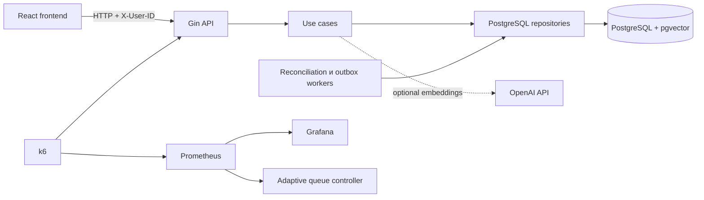

# GoodQueue

GoodQueue — full-stack MVP пользовательской очереди для покупки дефицитных товаров на классифайде. Сервис ставит покупателей в FIFO-очередь перед checkout, выдаёт персональное право на покупку с ограниченным сроком и не позволяет продать одну единицу товара нескольким пользователям.

Если товар закончился, GoodQueue предлагает доступные похожие объявления — с AI-ранжированием при наличии OpenAI API и детерминированным fallback без внешней зависимости.

## Демо

MVP развёрнут и доступен для проверки:

| Сервис | Адрес |
|---|---|
| Пользовательский интерфейс | <https://goodqueue.ivanzubkov.ru> |
| Backend readiness | <https://api.goodqueue.ivanzubkov.ru/readyz> |
| Swagger UI | <https://api.goodqueue.ivanzubkov.ru/docs> |
| Grafana | <https://grafana.goodqueue.ivanzubkov.ru> |
| Репозиторий | <https://github.com/Woolfer0097/GoodQueue> |

Для демонстрации регистрация и настоящая авторизация заменены выбором тестового пользователя, а реальный платёж — безопасной demo-оплатой.

## Проблема и ценность решения

При ажиотажном спросе несколько покупателей могут одновременно дойти до оплаты последней единицы. Часть пользователей тратит время и только в конце узнаёт, что товар уже продан. Для площадки это означает поздние отказы, лишнюю нагрузку и риск некорректных заказов.

GoodQueue переносит конкуренцию за товар в прозрачный управляемый процесс:

- товар резервируется атомарно и не продаётся дважды;
- пользователь всегда видит своё состояние и следующий шаг;
- забытый резерв автоматически освобождается по TTL;
- следующий участник приглашается в порядке FIFO;
- неудовлетворённый спрос остаётся на платформе благодаря похожим товарам;
- метрики позволяют настраивать вместимость очереди на основе фактической конверсии.

## Что реализовано в MVP

- каталог и карточки лимитированных товаров;
- очередь со статусом, позицией и возможностью выйти;
- два временных этапа права: `invited → checkout`;
- demo-оплата с атомарным списанием остатка;
- повторная покупка товара после завершённой покупки;
- восстановление активного сценария после обновления страницы;
- финальные состояния для отмены, expiry, ошибки оплаты и sold out;
- рекомендации только доступных похожих товаров;
- опциональные OpenAI embeddings и поиск по векторам `pgvector`;
- адаптивная вместимость waiting-очереди по метрикам HTTP и покупок;
- Prometheus, provisioned Grafana dashboard и просмотр логов через Dozzle;
- k6-нагрузочные сценарии, unit, integration, E2E и acceptance-тесты;
- Swagger, линтеры и GitHub Actions CI.

Регистрация, настоящая авторизация, полноценное оформление заказа и реальное списание денег считаются существующими внешними системами Авито и не дублируются в MVP.

## Пользовательский путь

1. Покупатель выбирает товар и нажимает «Купить».
2. Backend создаёт персональную попытку. При свободном остатке пользователь сразу получает резерв; иначе занимает место в `waiting`.
3. Когда резерв освобождается, первый пользователь получает `invited` и 10 минут на переход к checkout.
4. Перед checkout backend повторно проверяет пользователя, товар, состояние и deadline.
5. На оплату отводится 5 минут. Успешная demo-оплата переводит попытку в `purchased` и атомарно уменьшает остаток.
6. Отмена или истечение срока освобождает резерв и продвигает следующего пользователя.
7. При `sold_out` интерфейс показывает похожие доступные товары.

Переход на рекомендованный товар сам по себе не удаляет пользователя из текущей очереди: он может вернуться к активной попытке или явно отменить её.

### Состояния очереди

| Состояние | Что происходит | Следующий шаг |
|---|---|---|
| `waiting` | пользователь ожидает резерв | следить за позицией или выйти |
| `invited` | товар временно выделен пользователю | перейти к checkout до deadline |
| `checkout` | резерв удерживается на время оплаты | завершить оплату |
| `purchased` | покупка подтверждена | завершить путь или купить ещё |
| `invite_expired` | срок приглашения истёк | начать новую попытку |
| `checkout_expired` | срок checkout истёк | начать заново или выбрать аналог |
| `payment_failed` | оплата отклонена | повторить путь или выбрать аналог |
| `cancelled` | пользователь вышел из очереди | вернуться к товару |
| `sold_out` | доступный остаток исчерпан | выбрать похожий товар |

## Критические технические решения

### Защита от oversell

PostgreSQL является единственным источником истины. Все изменения одного товара проходят в транзакции с `SELECT ... FOR UPDATE`: попытка, резерв, остаток, payment inbox и notification outbox меняются согласованно. Ограничения и индексы базы дублируют ключевые инварианты приложения.

Поэтому два конкурентных запроса не могут получить право на последнюю единицу: транзакции будут обработаны последовательно, а вторая увидит уже занятый резерв.

### Персональное и одноразовое право

Frontend передаёт пользователя через демонстрационный `X-User-ID`, но решение всегда принимает backend. Начать checkout или оплатить можно только для своей активной попытки, нужного товара, разрешённого состояния и непросроченного deadline.

Идемпотентные ключи защищают повторные HTTP-запросы и платёжные события от двойного применения. Использованное право нельзя передать или применить ещё раз. После завершения пользователь может создать новую независимую попытку и купить ещё одну доступную единицу.

### Очередь и фоновые процессы

Waiting-часть работает по FIFO. Reconciliation worker завершает просроченные попытки, освобождает резерв и продвигает следующих пользователей. Ошибка обработки одного товара не останавливает остальные товары.

Notification outbox записывается в той же транзакции, а отдельный worker забирает события с lease/fencing token и retry. В MVP события публикуются в структурированные логи; в production publisher можно заменить брокером или push-сервисом.

### Рекомендации

`GET /api/v1/products/{productID}/alternatives` исключает исходный и недоступные товары. При включённом AI текстовые описания преобразуются OpenAI embeddings и сравниваются через `pgvector`. Если AI отключён или недоступен, используется воспроизводимый ranking по категории, цене и доступности. Очередь и резервирование от AI не зависят.

### Адаптивная очередь

Стартовая waiting-ёмкость рассчитывается как процент от `allocatable_stock`. Экспериментальный контроллер может корректировать этот процент по данным Prometheus:

- учитывает только достаточную выборку HTTP-запросов и завершённых checkout;
- проверяет технический success rate;
- использует конверсию `purchased / (purchased + cancelled + checkout_expired)`;
- ограничивает минимальное и максимальное значение и размер одного шага;
- при отсутствии или сомнительности метрик сохраняет последнее безопасное значение.

По умолчанию адаптивный режим выключен и используется статический `GOODQUEUE_WAITING_BUFFER_PERCENT`.

## Архитектура



Backend использует ручной dependency injection: зависимости создаются в composition root и передаются через конструкторы. Это сохраняет явные связи между HTTP, use case и repository-слоями и упрощает unit-тестирование без DI-фреймворка.

Frontend организован по Feature-Sliced Design и использует серверное состояние как источник истины. Polling восстанавливает актуальный статус после reload и переводит пользователя между страницами сценария.

### Структура репозитория

```text
.
├── cmd/                         # backend и команды нагрузочного контура
├── internal/
│   ├── app/                     # конфигурация, DI, HTTP и lifecycle
│   ├── pkg/domain/              # доменные модели и ошибки
│   ├── usecase/                 # очередь, checkout, оплата и каталог
│   ├── repository/postgres/     # транзакции и PostgreSQL repositories
│   ├── worker/                  # reconciliation и outbox
│   ├── adaptivequeue/           # контроллер вместимости очереди
│   ├── recommendation/openai/   # клиент embeddings
│   ├── e2e/                     # E2E и acceptance criteria
│   └── mockapi/                 # сценарии без PostgreSQL
├── frontend/src/                # FSD: app, entities, features, pages, shared, widgets
├── migrations/                  # Goose-миграции и demo seed
├── loadtest/                    # k6, Prometheus и Grafana
├── scripts/                     # интеграционные и конкурентные проверки
├── docs/                        # подробная документация frontend и Mock API
├── compose.yaml                 # локальный full-stack
├── Caddyfile                    # reverse proxy и production-домены
└── Makefile                     # единые команды разработки и CI
```

## Технологии

| Область | Стек |
|---|---|
| Backend | Go 1.25.7, Gin, pgx, Zap, Swaggo |
| Данные | PostgreSQL 18, pgvector, Goose, Go Jet |
| Frontend | React 19, TypeScript 6, Vite 8, React Router, Mantine, TanStack Query, Zod |
| Тестирование | Go testing, race detector, Jest, React Testing Library, PostgreSQL integration, HTTP E2E/AC, k6 |
| Качество | golangci-lint, go vet, ESLint, Prettier, TypeScript, Steiger |
| Наблюдаемость | Prometheus, Grafana, Dozzle, Zap JSON logs |
| Инфраструктура | Docker Compose, Nginx, Caddy, GitHub Actions |

## Локальный запуск

Требуется Docker Desktop с Docker Compose.

PowerShell:

```powershell
$env:GOODQUEUE_POSTGRES_PASSWORD = "goodqueue-local"
$env:VITE_API_URL = "http://localhost:2001"
$env:GOODQUEUE_CORS_ALLOWED_ORIGINS = "http://localhost:2000,http://127.0.0.1:2000"
docker compose up --build -d
```

Bash:

```bash
GOODQUEUE_POSTGRES_PASSWORD=goodqueue-local \
VITE_API_URL=http://localhost:2001 \
GOODQUEUE_CORS_ALLOWED_ORIGINS=http://localhost:2000,http://127.0.0.1:2000 \
docker compose up --build -d
```

Compose ждёт PostgreSQL, применяет миграции, запускает backend и только после его readiness — frontend.

| Компонент | Локальный адрес |
|---|---|
| Frontend | <http://localhost:2000> |
| Backend | <http://localhost:2001> |
| Swagger | <http://localhost:2001/docs> |
| Dozzle | <http://localhost:9999> |

Проверить и остановить:

```bash
docker compose ps
docker compose down
```

Если `5432` занят, задайте `GOODQUEUE_POSTGRES_PORT=15432`. Это меняет только внешний порт; контейнеры продолжат использовать `postgres:5432`.

### Мониторинг

Prometheus и Grafana подключаются overlay-файлом:

```powershell
$env:GOODQUEUE_POSTGRES_PASSWORD = "goodqueue-local"
$env:LOADTEST_GRAFANA_ADMIN_PASSWORD = "change-me"
docker compose -f compose.yaml -f loadtest/compose.loadtest.yaml up --build -d
```

- Grafana: <http://localhost:2002>, dashboard **GoodQueue — нагрузка и конверсия** импортируется автоматически;
- Prometheus: <http://localhost:9090>;
- метрики k6 включают RPS, duration percentiles, 4xx/5xx, ожидаемые ответы и исходы покупок.

Полные сценарии и профили описаны в [loadtest/README.md](loadtest/README.md). Быстрый прогон:

```bash
make loadtest-smoke
make loadtest-purchase-smoke
```

## API

Полный контракт доступен в Swagger. Основные маршруты:

| Метод | Маршрут | Назначение |
|---|---|---|
| `GET` | `/api/v1/products` | каталог |
| `GET` | `/api/v1/products/{id}` | карточка товара |
| `GET` | `/api/v1/products/{id}/alternatives` | похожие доступные товары |
| `POST` | `/api/v1/products/{id}/queue-entries` | встать в очередь |
| `GET` | `/api/v1/products/{id}/queue-entry` | получить активную попытку |
| `DELETE` | `/api/v1/products/{id}/queue-entry` | выйти из очереди |
| `POST` | `/api/v1/queue-attempts/{id}/checkout` | начать checkout |
| `POST` | `/api/v1/products/{id}/queue-attempts/{attemptID}/demo-payment` | завершить demo-покупку |
| `GET` | `/api/v1/demo/users` | тестовые пользователи |

Изменяющие запросы используют `X-User-ID`, а создание попытки и платёж — `Idempotency-Key`. Небезопасные внутренние stock/payment endpoints по умолчанию вообще не регистрируются и включаются только отдельными demo-флагами.

## Проверки качества

Backend:

```bash
make verify             # format, Swagger drift, unit, race, vet, lint, build
make verify-integration # migrations up/down/up, Jet drift, PostgreSQL, runtime, E2E/AC
make verify-all
```

Frontend:

```bash
cd frontend
npm ci
npm run format:check
npm run typecheck
npm run lint
npm run steiger
npm test -- --runInBand
npm run build
```

Acceptance-тесты проверяют главные требования кейса: единственное право на последнюю единицу, персональность права, невозможность обхода очереди, TTL, понятные terminal states, рекомендации и повторную покупку новой попыткой. GitHub Actions выполняет backend static/unit/race, frontend quality pipeline и отдельный PostgreSQL integration/runtime job на каждом push и pull request.

## Команда и вклад

Распределение основано на зонах ответственности и истории коммитов; участники также исправляли смежные части во время интеграции.

| Участник | Зона и вклад |
|---|---|
| [Кочегаров Данил — Woolfer0097](https://github.com/Woolfer0097) | Backend: каркас, state machine, двухэтапное право, payment inbox/outbox, workers, конкурентные интеграционные сценарии, CI и production Compose/Caddy |
| [Любченко Влад — Zoom7122](https://github.com/Zoom7122) | Backend/API: HTTP-контракты, Mock API, ошибки и CORS, позиция очереди, k6 seed/verify, purchase outcomes, Prometheus-агрегация и Dozzle |
| [Поздняков Никита — cunofou](https://github.com/cunofou) | Backend/data: PostgreSQL repositories, миграции и блокировки, E2E/AC, hardening, AI-рекомендации, pgvector fallback, Grafana, адаптивная очередь и документация |
| [Зубков Иван — Zis1220](https://github.com/Zis1220) | Frontend: React/FSD-приложение, каталог, очередь, checkout/result, polling, reload recovery, рекомендации, responsive UX и frontend-тесты |

## История разработки

Проект создавался тематическими ветками и pull request-ами. Ключевые вехи:

| Коммит | Результат |
|---|---|
| [`4f0635a`](https://github.com/Woolfer0097/GoodQueue/commit/4f0635a) | базовая backend-структура, Docker, миграции и Swagger |
| [`437d67c`](https://github.com/Woolfer0097/GoodQueue/commit/437d67c) | state machine, payment/outbox, workers и конкурентные тесты |
| [`2e22390`](https://github.com/Woolfer0097/GoodQueue/commit/2e22390) | PostgreSQL/k6 нагрузочный контур |
| [`230f863`](https://github.com/Woolfer0097/GoodQueue/commit/230f863) | AI-рекомендации с pgvector и fallback |
| [`af756bb`](https://github.com/Woolfer0097/GoodQueue/commit/af756bb) | provisioned Grafana dashboard |
| [`e18d2ac`](https://github.com/Woolfer0097/GoodQueue/commit/e18d2ac) | полный frontend queue flow |
| [`54b278d`](https://github.com/Woolfer0097/GoodQueue/commit/54b278d) | адаптивная вместимость очереди |
| [`2f3a34b`](https://github.com/Woolfer0097/GoodQueue/commit/2f3a34b) | безопасное завершение demo-checkout |
| [`2bf5f1a`](https://github.com/Woolfer0097/GoodQueue/commit/2bf5f1a) | повторные покупки отдельными попытками |

[Полная история коммитов](https://github.com/Woolfer0097/GoodQueue/commits/main/) сохраняет связь с ветками и pull request-ами.

## Ограничения MVP

- `X-User-ID` имитирует результат внешней аутентификации;
- demo-оплата не списывает реальные деньги и моделирует успешный ответ провайдера;
- outbox publisher пишет события в логи вместо брокера или push-сервиса;
- клиент получает состояние через polling, без WebSocket/SSE;
- AI embeddings обновляются лениво, отдельного catalog-indexer пока нет;
- адаптивный коэффициент хранится в памяти одного процесса;
- production SLO необходимо подтвердить большим прогоном на целевой инфраструктуре.

Эти ограничения не затрагивают основные инварианты: FIFO внутри товара, персональность и срок действия права, атомарный резерв и отсутствие oversell.

## Использование ИИ

OpenAI Codex применялся прозрачно как инженерный ассистент: для анализа требований, code review конкурентной логики, подготовки тестов, документации и запуска проверок. Демонстрационные изображения товаров были сгенерированы без брендов и текста и сохранены локально в WebP.

В runtime OpenAI используется только опционально для embeddings похожих товаров. ИИ не принимает решений о позиции, резерве, праве на покупку или списании остатка; при его недоступности работает обычный алгоритмический fallback.

## Дополнительная документация

- [Frontend README](frontend/README.md)
- [Пользовательский frontend-flow](docs/frontend-flow.md)
- [UI/UX-правила](docs/frontend-ui.md)
- [Mock API](docs/mock-api.md)
- [Нагрузочное тестирование и метрики](loadtest/README.md)
