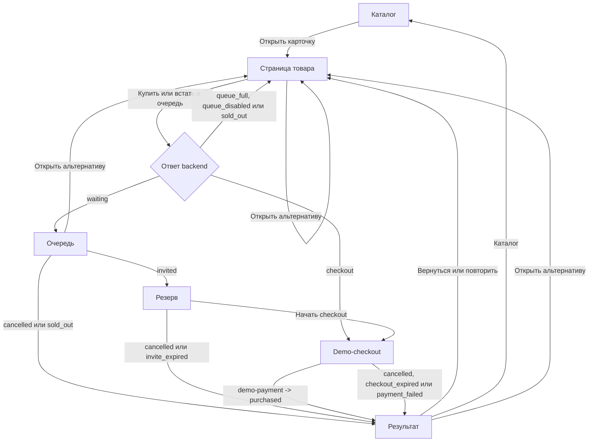

# Frontend flow

Frontend GoodQueue строится вокруг попытки покупки выбранного demo-пользователя. Backend
определяет состояние попытки, а SPA валидирует ответ, выбирает соответствующий экран и
показывает доступное действие.

## Маршруты

| URL                                | Экран                            |
| ---------------------------------- | -------------------------------- |
| `/`                                | каталог                          |
| `/products/:productId`             | товар и текущее действие покупки |
| `/products/:productId/queue`       | ожидание в очереди               |
| `/products/:productId/reservation` | персональный резерв              |
| `/products/:productId/checkout`    | demo-оформление                  |
| `/products/:productId/result`      | завершённая попытка              |
| `*`                                | страница 404                     |

Route state не хранит бизнес-данные. При прямом открытии URL или reload frontend получает
текущую попытку с backend. Если URL не соответствует её состоянию, страница заменяет маршрут
на актуальный. Если попытки больше нет, stage-экраны queue, reservation и checkout возвращают
пользователя к товару с объяснением, а result показывает состояние «Покупка не найдена».

## Основной путь

Если есть свободный товар, join может сразу вернуть `checkout`: искусственный экран очереди
не создаётся. Если свободного товара нет, но backend допускает ожидание, ответом становится
`waiting`.

Ошибки admission `queue_full`, `queue_disabled` и `sold_out` не создают фиктивную terminal
попытку на клиенте. Пользователь остаётся на странице товара и получает объяснение либо
обновлённое действие.

## Текущее действие на странице товара

До начала новой покупки frontend проверяет попытку выбранного пользователя.

| Текущее состояние                                                                | Действие на странице товара                                  |
| -------------------------------------------------------------------------------- | ------------------------------------------------------------ |
| попытки нет                                                                      | `Купить`, `Встать в очередь` или disabled CTA по доступности |
| `waiting`                                                                        | вернуться в очередь                                          |
| `invited`                                                                        | продолжить оформление резерва                                |
| `checkout`                                                                       | продолжить checkout                                          |
| `sold_out`                                                                       | посмотреть результат                                         |
| `cancelled`, `invite_expired`, `checkout_expired`, `payment_failed`, `purchased` | начать новую покупку по свежей доступности                   |

Завершённая покупка является историей, а не постоянной блокировкой товара для пользователя.
Одновременно frontend всё равно продолжает одну актуальную попытку на товар.

## Состояния попытки

| State API          | Маршрут        | Что показывает frontend                  | Основное действие                               |
| ------------------ | -------------- | ---------------------------------------- | ----------------------------------------------- |
| `waiting`          | `/queue`       | место, число ожидающих и прошедшее время | выйти из очереди                                |
| `invited`          | `/reservation` | персональный резерв и countdown          | начать checkout или отказаться                  |
| `checkout`         | `/checkout`    | товар, цену, countdown и demo-оплату     | завершить demo-покупку или отказаться           |
| `purchased`        | `/result`      | покупка завершена                        | вернуться к товару и при доступности купить ещё |
| `cancelled`        | `/result`      | покупка отменена                         | вернуться к товару или в каталог                |
| `invite_expired`   | `/result`      | резерв истёк                             | вернуться к товару                              |
| `checkout_expired` | `/result`      | оформление истекло                       | повторить покупку                               |
| `payment_failed`   | `/result`      | оплата не прошла                         | повторить покупку                               |
| `sold_out`         | `/result`      | товар закончился                         | вернуться в каталог или выбрать альтернативу    |

`next_action` и `message_code` проходят runtime-валидацию как часть ответа, но маршрутизация
строится по конечному набору `state`. Неизвестное состояние не попадает в UI.

## Polling и время

`QueuePollingRoute` запрашивает текущую попытку каждые 1,5 секунды только для `waiting`,
`invited` и `checkout`. Для terminal states polling прекращается.

Первый полученный ответ считается наблюдением и сам по себе не выталкивает пользователя со
страницы товара. Автоматическая навигация выполняется только после подтверждённого изменения
состояния этой же попытки. Экраны queue, reservation, checkout и result дополнительно
проверяют, что открытый URL соответствует текущему state.

Countdown для `invited` и `checkout` использует `deadline_at` либо `expires_at`. Достижение
нуля вызывает refetch. Frontend не создаёт `invite_expired` или `checkout_expired` локально.
Отдельный счётчик времени ожидания на queue-экране информационный и также не влияет на
состояние.

## Изменения состояния и кеш

1. Пользователь запускает действие.
2. Mutation отправляет публичный HTTP-запрос с `X-User-ID`; join и demo-payment также
   передают `Idempotency-Key`.
3. Ответ проверяется Zod-схемой `QueueAttempt`.
4. Подтверждённая попытка записывается в кеш TanStack Query.
5. `getQueueAttemptRoute` выбирает экран по `state`.

Повторный клик блокируется loading-состоянием. Для join один idempotency key переиспользуется
после неопределённой сетевой или серверной ошибки, но сбрасывается после подтверждённого
клиентского бизнес-ответа.

## Отмена

Отмена доступна в `waiting`, `invited` и `checkout`. После успешного DELETE frontend получает
или повторно загружает подтверждённый `cancelled`, обновляет query cache и открывает result.
Локальное удаление попытки не используется как доказательство отмены.

## Demo-payment

На checkout-экране frontend вызывает только публичный endpoint:

`POST /api/v1/products/:productID/queue-attempts/:attemptID/demo-payment`

Запрос содержит `X-User-ID` и `Idempotency-Key`. Успешный ответ должен содержать
`state = purchased`; после runtime-валидации frontend обновляет кеш и открывает result. Эта
кнопка демонстрирует только успешный исход и не списывает деньги.

Frontend не вызывает `/internal/v1/payment-events` и не может самостоятельно создать
`payment_failed`.

## Похожие товары

`RelevantProducts` загружает `/alternatives`, сохраняет порядок ответа и переиспользует
`ProductCard`. Frontend не выбирает recommendation mode, не рассчитывает score и не задаёт
количество результатов.

Блок показывается:

- на странице товара;
- на queue-экране, пока state равен `waiting`;
- в result для `cancelled`, `checkout_expired`, `payment_failed` и `sold_out`.

## Ошибки и восстановление

- `404` текущей попытки означает, что активной попытки нет, а не поломку соединения.
- `queue_full`, `queue_disabled` и `sold_out` получают отдельные пользовательские сообщения.
- Ошибка проверки текущей попытки блокирует новую покупку до безопасного refetch.
- Некорректный или отсутствующий product ID показывает состояние «Товар не найден».
- При ошибке загрузки queue, reservation, checkout или result пользователь может повторить
  GET-запрос, не создавая новую попытку.

## Связанные документы

- [Реализованный UI/UX](frontend-ui.md)
- [Интеграция frontend с Mock API](mock-api.md)
- [Frontend README](../frontend/README.md)
