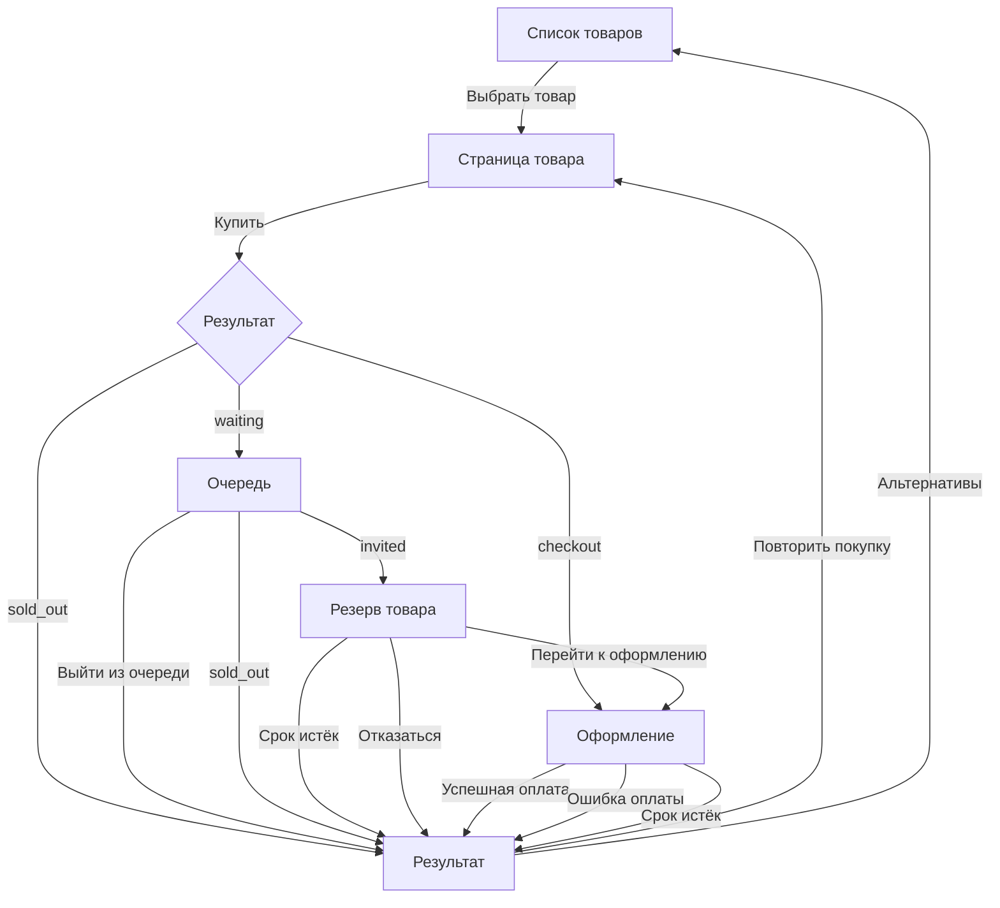

# Frontend flow

Frontend GoodQueue строится вокруг состояния попытки покупки. Backend определяет текущее состояние, а frontend показывает соответствующий экран и доступное пользователю действие.

## Пользовательский путь

Если товар доступен сразу, пользователь может перейти со страницы товара непосредственно к оформлению, минуя ожидание в очереди.

## Состояния и экраны

| Состояние | Экран | Действие |
| --- | --- | --- |
| — | Страница товара | Купить |
| `waiting` | Очередь | Выйти из очереди |
| `invited` | Резерв товара | Перейти к оформлению |
| `checkout` | Оформление заказа | Завершить demo-оплату или отказаться |
| `purchased` | Результат | Покупка завершена; можно вернуться к товару и начать новую покупку |
| `invite_expired` | Результат | Вернуться к товару |
| `checkout_expired` | Результат | Повторить покупку |
| `payment_failed` | Результат | Повторить покупку |
| `cancelled` | Результат | Вернуться к товару |
| `sold_out` | Результат | Посмотреть альтернативы |

## Основные принципы

- backend является источником состояния очереди и резерва;
- frontend регулярно обновляет состояние активной попытки;
- для резерва и оформления отображается оставшееся время;
- после завершения попытки polling прекращается;
- при отсутствии товара пользователю предлагаются альтернативы.

Точный API-контракт и готовые mock-сценарии описаны в `docs/mock-api.md`.
