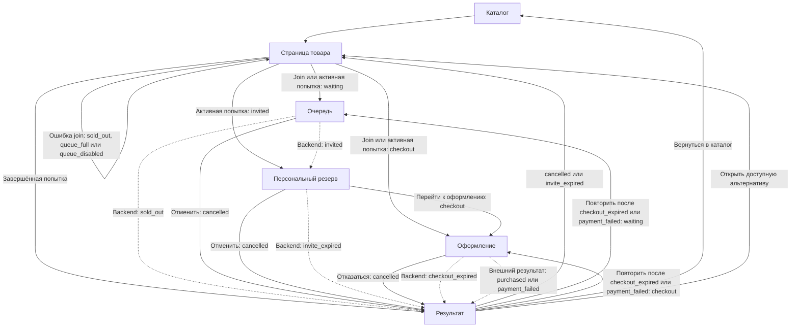
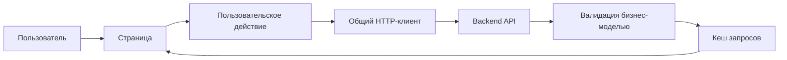

# GoodQueue Frontend

> Пользовательский интерфейс очереди на покупку дефицитных товаров для marketplace-сценария.

GoodQueue заменяет поздний отказ «товар уже купили» на прозрачный управляемый процесс.
Пользователь видит своё место в FIFO-очереди, получает ограниченное по времени право на
покупку и понимает следующий шаг при любом результате. **Если исходный товар закончился,
интерфейс предлагает доступные похожие лоты**.

Frontend не распределяет товар самостоятельно: backend остаётся источником истины для
очереди, резерва, сроков и результата покупки. Клиент валидирует ответы API, показывает
подтверждённое состояние и не создаёт бизнес-переходы по локальному таймеру.

## Содержание

- [Что решает frontend](#что-решает-frontend)
- [Соответствие требованиям кейса](#соответствие-требованиям-кейса)
- [Задачи сверх ТЗ](#задачи-сверх-тз)
- [Возможности](#возможности)
- [Быстрый запуск](#быстрый-запуск)
- [Пользовательские сценарии](#пользовательские-сценарии)
- [Стек](#стек)
- [Архитектура](#архитектура)
- [Маршруты](#маршруты)
- [API и переменные окружения](#api-и-переменные-окружения)
- [Проверки](#проверки)
- [Production-сборка](#production-сборка)
- [Границы MVP](#границы-mvp)

## Что решает frontend

При ограниченном остатке обычный checkout создаёт гонку: несколько покупателей доходят до
последнего шага, хотя купить сможет только один. GoodQueue добавляет перед оформлением
персональную очередь и делает состояние покупки понятным на каждом этапе.

Frontend отвечает за три пользовательские задачи:

- показать, доступна ли покупка сразу или только через очередь
- провести пользователя через ожидание, временный резерв и checkout без ложных обещаний
- не оставлять пользователя в тупике после отмены, истечения срока, ошибки оплаты или
  sold out

Главный конкурентный инвариант — не выдать прав больше, чем доступно товара. Обеспечивается
backend транзакциями PostgreSQL. Frontend намеренно не дублирует эту логику и не вычисляет
состояние очереди из клиентских данных.

## Соответствие требованиям кейса

| Требование                       | Реализация во frontend                                                                                                            | Источник истины                              |
| -------------------------------- | --------------------------------------------------------------------------------------------------------------------------------- | -------------------------------------------- |
| Понятная очередь                 | Экран ожидания показывает позицию, число ожидающих и фактическое время ожидания без выдуманного ETA                               | Backend возвращает позицию и состояние       |
| Одно право на ограниченный товар | UI открывает резерв или checkout только после соответствующего ответа API                                                         | Backend атомарно распределяет остаток        |
| Персональность права             | Все операции попытки выполняются для выбранного demo-пользователя через `X-User-ID`. Чужое состояние не переиспользуется из cache | Backend проверяет владельца `attempt`        |
| Невозможность обойти очередь     | Прямые URL восстанавливают попытку из API и перенаправляют на экран её фактического состояния                                     | Backend разрешает только допустимые переходы |
| Ограниченный срок                | Резерв и checkout показывают countdown по серверному deadline. На нуле клиент только обновляет данные                             | Backend завершает просроченную попытку       |
| Однозначный результат            | Девять состояний попытки сведены к понятным экранам и доступным действиям                                                         | Backend определяет текущее состояние         |
| Повтор без дублей                | На одно намерение входа создаётся один `Idempotency-Key`, а повторный клик блокируется на время запроса                           | Backend гарантирует идемпотентность команды  |
| Негативный исход без тупика      | Для восстановимых состояний доступны повтор покупки, возврат к товару или похожие товары                                          | API возвращает доступные альтернативы        |

Конкурентная гарантия и защита права проверяются backend acceptance-тестами. Frontend-тесты
проверяют пользовательское отображение этих состояний, переходы, повторные действия,
ошибки и восстановление после перезагрузки.

## Задачи сверх ТЗ

Базовый сценарий очереди решает проблему конкурентной покупки. Для реального marketplace
этого недостаточно: ожидание и отказ не должны становиться моментом, когда пользователь
закрывает страницу и продолжает поиск на другой площадке.

### Почему пользователь останется на платформе

GoodQueue не запирает пользователя на экране ожидания. Пока его место сохраняется на
backend, он видит похожие доступные товары и может открыть любое предложение. Переход к
другому товару не отменяет исходную попытку. Когда пользователь возвращается к исходному
товару, контекстное действие ведёт его к сохранённому месту, резерву или checkout.

Если покупка не состоялась, интерфейс сразу предлагает продолжение. После `sold_out`,
`payment_failed`, `checkout_expired` или отмены пользователь получает подходящее действие
и блок альтернатив. Вместо тупикового отказа он остаётся внутри каталога и может перейти
к другому доступному предложению в один клик.

| Дополнительная задача                   | Что реализовано                                                        | Продуктовый эффект                                                        |
| --------------------------------------- | ---------------------------------------------------------------------- | ------------------------------------------------------------------------- |
| Сохранить интерес во время ожидания     | Похожие товары доступны прямо на экране очереди                        | Пользователь продолжает изучать каталог, пока место в очереди сохраняется |
| Вернуть пользователя к активной покупке | Страница товара остаётся доступной, а CTA ведёт к текущему этапу       | Можно сравнивать предложения без страха потерять резерв или очередь       |
| Продолжить путь после отказа            | Для восстановимых результатов показаны повтор покупки и альтернативы   | Негативный исход становится новой точкой выбора, а не выходом из сценария |
| Сохранить доверие                       | Нет выдуманного ETA, ложного progress и фиктивной оплаты               | Интерфейс обещает только то, что подтверждено backend                     |
| Снизить зависимость от внешних ресурсов | Работают прямые URL, reload, безопасные ошибки и локальные изображения | Основной сценарий сохраняется при повторном открытии и проблемах с медиа  |

## Возможности

- Адаптивный каталог демонстрационных товаров
- Страница товара с ценой, доступностью, описанием и похожими предложениями
- Контекстный CTA: `Купить`, `Встать в очередь` или переход к уже активной покупке
- Переключатель demo-пользователей для работы с независимыми попытками покупки
- Сохранение выбранного пользователя в `localStorage` с проверкой актуальности UUID
- Идемпотентный вход в очередь и защита от повторных кликов во время запроса
- Фоновый polling активной попытки каждые 1,5 секунды без мигания страницы
- Экран ожидания с позицией, числом ожидающих, прошедшим временем и отменой
- Экран персонального резерва с server-deadline countdown
- Checkout-граница, показывающая подтверждённое право на покупку без имитации оплаты
- Отдельные результаты для `purchased`, `cancelled`, `invite_expired`,
  `checkout_expired`, `payment_failed` и `sold_out`
- Повтор покупки после восстановимых ошибок и рекомендации доступных товаров
- Восстановление правильного экрана по прямому URL и после перезагрузки
- Loading, empty, 404 и безопасные error states без вывода технических сообщений API
- Светлая и тёмная темы, responsive layout и доступные с клавиатуры действия

## Быстрый запуск

### Зависимости для запуска

- Node.js `>=24.19.0 <25`. Версия `24.19.0` зафиксирована в `.nvmrc`
- npm `11.17.0`
- доступный backend API

Из директории `frontend`:

```bash
cp .env.example .env
npm ci
npm run dev
```

Frontend будет доступен на <http://localhost:5173>. Адрес backend задаётся в `.env`:

```env
VITE_API_URL=http://localhost:8080
```

Если backend работает на другом адресе, измените только `VITE_API_URL`. Backend должен
разрешать origin frontend через CORS.

## Пользовательские сценарии

### Покупка без ожидания

1. Пользователь открывает каталог и выбирает товар
2. На странице товара нажимает `Купить`
3. Backend подтверждает наличие свободного товара и создаёт попытку в состоянии `checkout`
4. Frontend открывает оформление, показывает товар, цену и оставшееся время резерва

### Покупка через очередь

1. Пользователь выбирает товар без свободного остатка и нажимает `Встать в очередь`
2. Экран ожидания показывает место, число ожидающих и прошедшее время
3. Frontend обновляет попытку в фоне, не перезагружая страницу
4. После ответа `invited` открывается персональный резерв с countdown
5. Пользователь переходит к оформлению или освобождает резерв

### Просмотр других товаров во время ожидания

1. На экране очереди пользователь видит похожие доступные товары
2. Он может открыть другое предложение, не отменяя исходную попытку
3. При возвращении к исходному товару контекстный CTA ведёт к активной очереди, резерву
   или checkout

### Неуспешный результат покупки

1. Backend возвращает `sold_out`, `payment_failed`, `checkout_expired` или `cancelled`
2. Frontend показывает отдельное объяснение результата и подходящее следующее действие
3. Пользователь может повторить покупку, вернуться к товару или выбрать альтернативу

### Карта переходов

Сплошные линии обозначают действие пользователя. Пунктирные линии обозначают изменение
состояния на backend, которое frontend обнаруживает при следующем polling-запросе.



| Состояние API      | Маршрут                            | Как появляется во frontend                            | Доступное действие                                  |
| ------------------ | ---------------------------------- | ----------------------------------------------------- | --------------------------------------------------- |
| `waiting`          | `/products/:productId/queue`       | Успешный join или polling                             | Выйти из очереди или открыть похожий товар          |
| `invited`          | `/products/:productId/reservation` | Polling обнаружил приглашение backend                 | Перейти к оформлению или отказаться                 |
| `checkout`         | `/products/:productId/checkout`    | Join при свободном товаре или старт из `invited`      | Отказаться и освободить товар                       |
| `purchased`        | `/products/:productId/result`      | Polling получил внешний результат через backend       | Вернуться в каталог                                 |
| `cancelled`        | `/products/:productId/result`      | Backend подтвердил отмену                             | Вернуться к товару, в каталог или к альтернативе    |
| `invite_expired`   | `/products/:productId/result`      | Polling обнаружил истечение приглашения               | Вернуться к товару или в каталог                    |
| `checkout_expired` | `/products/:productId/result`      | Polling обнаружил истечение оформления                | Повторить покупку, открыть каталог или альтернативу |
| `payment_failed`   | `/products/:productId/result`      | Polling получил неуспешный внешний результат          | Повторить покупку, открыть каталог или альтернативу |
| `sold_out`         | `/products/:productId/result`      | Polling обнаружил исчерпание товара во время ожидания | Вернуться в каталог или выбрать альтернативу        |

Ошибки `sold_out`, `queue_full` и `queue_disabled` во время join не создают новый экран
результата. Frontend остаётся на странице товара и показывает доступное состояние или
уведомление.

## Стек

| Область           | Технологии                           |
| ----------------- | ------------------------------------ |
| Frontend          | React 19, TypeScript 6, Vite 8       |
| Routing           | React Router 8                       |
| Server state      | TanStack Query 5                     |
| UI                | Mantine 9, CSS Modules, Tabler Icons |
| Runtime-валидация | Zod 4                                |
| Архитектура       | Feature-Sliced Design                |
| Тестирование      | Jest 30, React Testing Library       |
| Качество          | ESLint 10, Prettier 3, Steiger       |
| Production        | Multi-stage Docker image, Nginx      |

Отдельный глобальный state manager не используется: серверное состояние хранится в
TanStack Query, выбранный demo-пользователь — в предметном React context.

## Архитектура

Frontend построен по Feature-Sliced Design. Каждый слой отвечает на простой вопрос:

| Слой       | Ответственность                                | Примеры                                               |
| ---------- | ---------------------------------------------- | ----------------------------------------------------- |
| `app`      | Как запускается и связывается приложение       | Провайдеры, маршрутизация, layout и тема              |
| `pages`    | Как выглядит законченный экран                 | Каталог, товар, очередь, резерв, checkout и результат |
| `widgets`  | Какие крупные блоки повторяются на страницах   | Хлебные крошки и похожие товары                       |
| `features` | Что пользователь может сделать                 | Войти в очередь, отменить попытку, выбрать аккаунт    |
| `entities` | С какими бизнес-данными работает интерфейс     | Товар, пользователь и попытка покупки                 |
| `shared`   | Какие технические инструменты нужны всем слоям | HTTP-клиент, валидация и работа со временем           |

Зависимости направлены сверху вниз. Страница собирает готовые пользовательские действия.
Действие работает с бизнес-сущностью. Общая инфраструктура ничего не знает о товарах и
очереди.



Например, нажатие `Купить` проходит по одной понятной цепочке:

1. Страница товара выбирает подходящий CTA по наличию и текущей попытке
2. Feature `join-queue` отправляет запрос с `X-User-ID` и `Idempotency-Key`
3. Ответ backend валидируется как `QueueAttempt` и сохраняется в TanStack Query
4. Общая функция маршрутизации открывает очередь, резерв, checkout или результат
5. Для активного состояния polling обновляет данные и переводит пользователя дальше только
   после изменения состояния на backend

Так бизнес-правила не размазаны по страницам. Join, polling и прямое открытие URL используют
одну модель попытки и одну карту маршрутов.

## Маршруты

| URL                                | Экран               |
| ---------------------------------- | ------------------- |
| `/`                                | Каталог             |
| `/products/:productId`             | Страница товара     |
| `/products/:productId/queue`       | Ожидание в очереди  |
| `/products/:productId/reservation` | Персональный резерв |
| `/products/:productId/checkout`    | Оформление          |
| `/products/:productId/result`      | Результат покупки   |
| `*`                                | Страница 404        |

Route state не используется как источник бизнес-данных. Поэтому прямые ссылки и reload
восстанавливаются через backend, а устаревший или неподходящий URL заменяется маршрутом
фактического состояния попытки.

## API и переменные окружения

Frontend работает с публичным HTTP-контрактом GoodQueue:

| Метод    | Endpoint                                     | Назначение                         |
| -------- | -------------------------------------------- | ---------------------------------- |
| `GET`    | `/api/v1/demo/users`                         | Демонстрационные пользователи      |
| `GET`    | `/api/v1/products`                           | Каталог                            |
| `GET`    | `/api/v1/products/:productID`                | Карточка товара                    |
| `GET`    | `/api/v1/products/:productID/alternatives`   | Похожие доступные товары           |
| `GET`    | `/api/v1/products/:productID/queue-entry`    | Текущая попытка пользователя       |
| `POST`   | `/api/v1/products/:productID/queue-entries`  | Начать покупку или войти в очередь |
| `DELETE` | `/api/v1/products/:productID/queue-entry`    | Отменить активную попытку          |
| `POST`   | `/api/v1/queue-attempts/:attemptID/checkout` | Перейти из резерва в checkout      |

Актуальный контракт можно проверить в Swagger UI backend по пути `/docs`.

| Переменная     | Назначение           |
| -------------- | -------------------- |
| `VITE_API_URL` | Base URL backend API |

## Проверки

Полный frontend-checklist:

```bash
npm run typecheck
npm run lint
npm run steiger
npm run format:check
npm test -- --runInBand
npm run build
```

| Команда                 | Назначение                               |
| ----------------------- | ---------------------------------------- |
| `npm run dev`           | Запуск Vite в development-режиме         |
| `npm run build`         | TypeScript-проверка и production-сборка  |
| `npm run typecheck`     | Проверка TypeScript без сборки           |
| `npm run lint`          | Проверка ESLint                          |
| `npm run lint:fix`      | Исправление доступных ESLint-ошибок      |
| `npm run steiger`       | Проверка правил Feature-Sliced Design    |
| `npm run format:check`  | Проверка форматирования Prettier         |
| `npm run format`        | Форматирование проекта                   |
| `npm test`              | Запуск Jest                              |
| `npm run test:watch`    | Jest в watch-режиме                      |
| `npm run test:coverage` | Jest с отчётом о покрытии                |
| `npm run preview`       | Локальный просмотр собранного приложения |

Тесты покрывают API-схемы, UI-компоненты и сквозной пользовательский сценарий: прямые
URL и reload, loading и повторные клики, безопасные ошибки, polling, отмену, истечение
deadline, terminal states, повтор покупки и рекомендации.

## Production-сборка

```bash
npm run build
```

Статические файлы создаются в `dist`. `npm run preview` подходит только для локальной
проверки сборки.

Docker-образ собирается из директории `frontend`:

```bash
docker build --build-arg VITE_API_URL=http://localhost:8080 -t goodqueue-frontend .
```

`VITE_API_URL` встраивается Vite во время сборки. Изменение переменной при запуске готового
контейнера не поменяет адрес API — образ нужно пересобрать с новым build argument.

Production-слой использует Nginx, отдаёт статические assets с cache headers и возвращает
`index.html` для клиентских маршрутов React Router.

## Границы MVP

- `X-User-ID` — демонстрационная замена идентичности после внешней авторизации, а не
  production-механизм аутентификации
- Реальная платёжная форма, списание денег, создание заказа и возвраты принадлежат внешним
  системам marketplace
- Frontend не вызывает внутренний `/internal/v1/payment-events` и не создаёт
  `purchased` или `payment_failed` самостоятельно
- Countdown нужен только для отображения. Истечение срока подтверждается повторным запросом
  к backend
- Обновление активной попытки реализовано polling-запросами. WebSocket/SSE и
  push-уведомления не входят в MVP
- Demo user selector позволяет переключаться между независимыми попытками. В реальном
  продукте идентичность должна приходить из доверенного auth-контекста
- Frontend поставляется как самостоятельное SPA, а не как готовый встраиваемый виджет

Эти ограничения не влияют на основной пользовательский сценарий: пользователь получает
понятное состояние, не может пройти checkout без подтверждённого права и может продолжить
путь после негативного результата.
